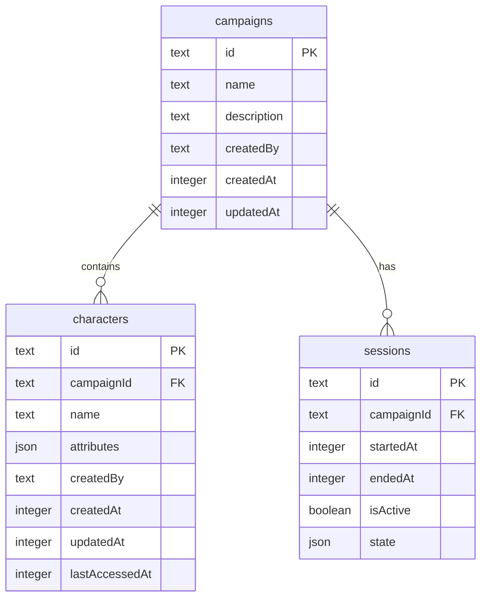

# Superhero TTRPG

Next.js app which serves both the frontend and the backend for Calling All Heroes TTRPG.

## Quick Start

```bash
# Clone and install
git clone <repo-url>
cd superhero-ttrpg
npm install

# Start development server
npm run dev
```

Open [http://localhost:3000](http://localhost:3000)

The SQLite database is automatically created and migrations run on startup.  
Inspect database: `sqlite3 data/superhero-ttrpg.db` or use Drizzle Studio: `npm run db:studio`

## Environment Variables

Optional `.env.local` (defaults work out of the box):

```env
DATABASE_PATH=./data/superhero-ttrpg.db
NEXT_PUBLIC_WS_URL=http://localhost:3000
```

## Database Schema



### Character Attributes

The `attributes` field is a flexible JSON column that can store any character data. See [`src/db/schema.ts`](src/db/schema.ts) for the TypeScript type definition.

## Database Management

```bash
# Generate new migration files
npm run db:generate

# Push schema changes to database
npm run db:push

# Generate + push (combined)
npm run db:migrate

# Open Drizzle Studio (database GUI)
npm run db:studio
```

## Docker Deployment

```bash
# Build image
docker build -t superhero-ttrpg .

# Run container
docker run -d \
  --name superhero-ttrpg \
  -p 3000:3000 \
  -v /var/lib/ttrpg-data:/app/data \
  --restart unless-stopped \
  superhero-ttrpg
```

Database persists in the mounted volume.

## License

MIT
